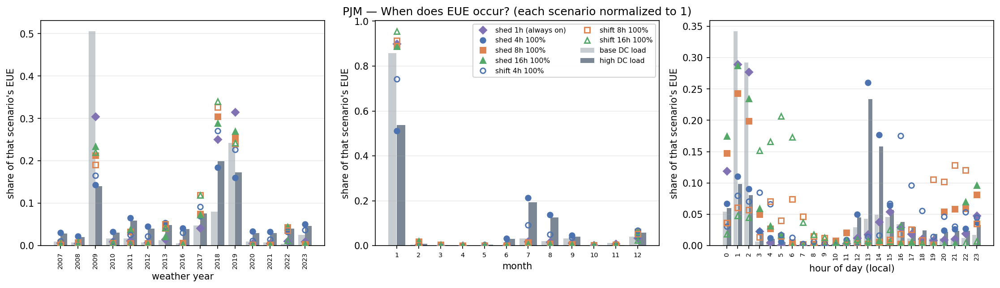

# Datacenter load, demand response, and resource adequacy — brief results

**PJM and ERCOT, ReEDS model year 2032 · PRAS · 15 weather years (2007–2021) ×
1000 Monte Carlo samples**
Prepared 2026-07-22 · reproducible via `scripts/00`–`04`, see [README.md](README.md)

---

## What was done

ReEDS built a 2032 grid under the **default** demand forecast — every generator,
battery and transmission line. That fleet was then **frozen**.

PRAS took the frozen fleet and simulated the year hour by hour, 8760 hours × 15
weather years, 1000 times over, randomly failing generators at their forced-outage
rates. Each hour it asks whether generation plus imports could serve load; when
they could not, it records the shortfall. **NEUE** (normalized expected unserved
energy, in parts per million) is that shortfall as a share of total load.

That simulation was run twice — once with normal load, once with datacenter load
added on top — **using the same power plants both times**. Then demand response
was layered on: each region received a DR device sized as a fraction of *its own
added datacenter load*, swept from 5 % to 100 %, in two flavors:

- **shift** — load moved to a later hour and repaid within the payback window; available 24/7.
- **shed** — load dropped and never repaid; available only in a fixed daily window.

Because the buildout never changes, any difference in NEUE is attributable to the
added load and to the DR — not to different generation. The question being answered
is deliberately narrow: **can flexible datacenter load substitute for generation
that was never built?**

92 PRAS runs in total: 68 PJM, 24 ERCOT.

---

## Headline results

### 1. ERCOT shows no reliability impact at all

All 24 ERCOT runs report **exactly zero** unserved energy — both baselines and
every DR case. This is not a failed run: the added load is present (+8 879 MW at
peak), but ERCOT enters 2032 with ~41 % reserve margin at peak against PJM's 28 %,
and a mean forced-outage rate about a third of PJM's. It simply never runs short.

**Everything below is therefore PJM only.**

### 2. Datacenter load raises PJM's NEUE 21×

| case | NEUE (ppm) | EUE (MWh over 15 weather years) |
|---|---:|---:|
| base demand, no DR | 0.0086 | 113 |
| **+ datacenter load, no DR** | **0.1796** | **2 565** |
| + datacenter load, best DR (`shift_16h`, 100 %) | 0.0932 | 1 332 |

Even the best DR case leaves NEUE ~11× above the base-demand level. **DR
meaningfully mitigates but does not neutralize the added load.**

For context, PJM's reliability standard is conventionally 1 day in 10 years; all
of these NEUE values are small in absolute terms. The story here is the *relative*
change and *where* it lands.

### 3. Nearly all of it is one small region

**99.0 % of PJM's unserved energy occurs in region p124**, which receives only
**0.3 % of the added datacenter load**. Meanwhile p99 absorbs 47 % of the added
load and contributes 0.9 % of the EUE.

p124 is a small, wind-dependent, weakly-connected pocket:

| p124 | value |
|---|---:|
| peak load | 220 MW |
| firm (non-VRE) capacity | **60 MW** |
| wind capacity | up to 2 611 MW |
| storage | 148 MW |
| **import capability** | **80 MW** (lowest ratio to peak load in PJM) |
| hours with negative local margin | 11.2 % |
| hours negative *even with full imports* | 2.0 % |

So p124 covers a 220 MW peak with 60 MW of firm capacity, leaning on wind it
cannot replace and cannot import around. Adding ~30 MW of datacenter load — a 14 %
increase on its peak — pushes it over. **This is a local deliverability problem
that datacenter load exposed, not a system-wide capacity shortfall.**

Consistent with that: only **1 % of the 248 outage episodes involve more than one
region**. These are isolated local events, not correlated system-wide scarcity.

#### p124 fails only in the low tail of its own wind output

**100 % of p124's EUE occurs when its wind output is ≤ 77 MW**, against 2 611 MW
of capacity and an all-hours median of 1 009 MW. Median wind during EUE hours is
**4 MW**. Only 14 % of EUE hours have wind at exactly zero, but 97 % are at or
below 50 MW and those carry 99.8 % of the energy — so the driver is a wind
*drought*, not literal zero.

The arithmetic closes exactly:

| | MW |
|---|---:|
| firm capacity (constant) | 60 |
| import limit | 80 |
| **servable without wind** | **140** |
| load during EUE hours | median 150, max 207 |

p124 is short by ~10 MW at median load and ~67 MW at peak, so it needs roughly
**70 MW of wind — 2.7 % of its installed capacity** — to close the gap, or the
battery until it drains at 2.9 h. That threshold is why no EUE hour ever has more
than 77 MW of wind. Given wind at exactly zero (790 h over 15 weather years),
29.5 % of those hours produce EUE; the rest are covered by storage or low load.

**This makes the stranded-wind observation a red herring for adequacy.** The
2.5 GW is irrelevant to reliability except through the bottom ~3 % of its output
distribution. It also explains why a 30 MW DR device covers so much of the gap:
the deficit is genuinely shallow.

Two distinct failure modes appear, and the split matters:

| | hours | share of EUE | mean EUE/hour |
|---|---:|---:|---:|
| **capacity-short** (load > firm + import + VRE) | 628 (38 %) | **72 %** | 2.90 MWh |
| **outage-driven** (nameplate adequate; forced-outage tail) | 1 013 (62 %) | 28 % | 0.71 MWh |

Because `/eue` is a *mean over 1000 Monte Carlo samples*, an hour can carry a
small positive expectation even when nameplate capacity covers load — a minority
of draws lose part of the 60 MW firm fleet or the tie. Most hours are of this
type, but they contribute little energy; the real damage is the 628
genuinely-short hours.

#### Structural detail

| p124 structure | |
|---|---|
| transmission | a **single radial tie** to p123: **80 MW in, 336 MW out** |
| offshore wind | **2 536 MW** — 11.5× the zone's own peak load |
| onshore wind / solar | 75 MW / 97 MW |
| firm generation | 22 oil-gas-steam units totalling **60 MW**; twelve are 0 MW, most of the rest are 1–2 MW |
| battery | 426 MWh / 148 MW = **2.9 h** |

The arithmetic fails in both directions:

- **Outbound:** 167 TWh of VRE generated against 19.9 TWh of local load, behind
  336 MW of export capacity. **116 TWh (69.6 %) is stranded** — in 66 % of all
  hours p124 produces more than it can consume or ship out.
- **Inbound:** 11.2 % of hours have load above VRE + firm; after the 80 MW import
  limit, 2 603 hours (2.0 %) remain short. Those deficits are **shallow but long**
  — a 55 MW maximum, but **386 of 853 episodes outrun the battery's 2.9 h**.

That last line is the mechanism behind every PJM result in this study: a wind
drought lasting more than about three hours, in a zone with 60 MW of real
generation behind an 80 MW tie. It also explains why a mere 30 MW DR device is so
effective there — the deficit never exceeds 55 MW.

**This is not a translation bug.** Two tempting explanations were checked and both
fail:

- *"The offshore wind's interconnection is missing."* No — the plant sits inside
  p124, so no interconnection to it is required, and p124 exports through the
  336 MW backward capacity on its tie. Confirmed against the
  [PRAS HDF5 spec](https://natlabrockies.github.io/PRAS/stable/SystemModel_HDF5_spec/):
  `forwardcapacity` is `region_from`→`region_to`, so the p123→p124 line gives
  p124 80 MW in and 336 MW out.
- *"The 80/336 asymmetry is anomalous."* No — **all 41 PJM lines are asymmetric,
  none symmetric.** Directional ratings are simply how ReEDS transmission
  translates into PRAS. p124's 4.2× ratio is unremarkable next to p110|p118's 13×.

So p124 is genuinely capacity-deficient **in the modeled system**, and that is a
real property of what ReEDS built rather than an artifact of the PRAS conversion.

The likely explanation is policy, not error. The ReEDS scenario is
`high_currentpolicy_central`, and current policy includes **state offshore-wind
mandates**. ReEDS would be obliged to build that 2 536 MW regardless of
deliverability; if it did not co-optimize a matching tie, the result is exactly
what is observed — policy-driven offshore wind, ~70 % of it curtailed, in a
balancing area with 60 MW of firm capacity. Ordinary model behavior under a
binding constraint.

**What this means for interpretation:** the result is real within the model, but
narrow. It says a small coastal BA meeting an offshore-wind mandate has thin firm
capacity behind a small tie, and ~30 MW of datacenter load tips it over. It does
**not** say PJM at large has a datacenter-driven adequacy problem.

Worth confirming: does the ReEDS run itself show comparable curtailment in p124?
If so, this is settled as expected behavior rather than a data issue.

### 4. The failures are low-wind, high-net-load evening hours

| condition | all hours | during EUE (EUE-weighted) |
|---|---:|---:|
| regional net-load percentile | 0.50 | **0.986** |
| regional margin percentile | 0.50 | **0.014** |
| wind capacity factor | 0.425 | **0.005** |
| solar capacity factor | 0.227 | 0.032 |

The wind number is the mechanism. In a region that depends on wind for capacity,
EUE occurs when wind output is at **half a percent** of its maximum. Events cluster
in evening and overnight hours (peaking 8 pm–1 am local), split between winter and
summer, with essentially nothing in spring.

### 5. Adding datacenter load moves the problem, not just its size

Comparing *normalized* distributions between the base and high scenarios (total
variation distance; 0 = identical shape):

| dimension | shift |
|---|---:|
| weather year | 0.45 |
| month | 0.43 |
| hour of day | 0.22 |

Weather-year and seasonal patterns change substantially — **41 % of the high case's
EUE occurs in hours that had none at all in the base case**. So the added load is
not simply scaling up existing bad hours; it is creating new failure hours in
different weather years and seasons. Hour-of-day shifts much less, which fits a
local capacity deficit rather than a change in daily shape.

### 6. DR helps, gradually, with no useful cut-off point

| DR family | NEUE floor at 100 % | share of datacenter penalty recovered |
|---|---:|---:|
| **shift 16 h** | **0.0932** | **50.5 %** |
| shed 16 h | 0.1102 | 40.6 % |
| shift 8 h | 0.1293 | 29.4 % |
| shed 8 h | 0.1377 | 24.5 % |
| shed 4 h | 0.1525 | 15.8 % |
| shift 4 h | 0.1536 | 15.2 % |

There is **no sharp knee** — no fraction past which added DR stops helping. Returns
decline smoothly; reaching 80 % of everything achievable needs a DR fraction of
roughly 0.7–0.8.

**Device duration matters far more than deployment share.** Going 4 h → 16 h roughly
triples the benefit; raising the fraction within a family does much less.

**Most of that benefit comes from 30 MW in the right place — and it is not
enough.** In the best case, p124's 30 MW DR device delivers 1 210 MWh of the total
1 234 MWh reduction (98 %). The other ~10 100 MW of DR spread across the system
contribute almost nothing, because those regions have almost no EUE to fix. But
p124 is not over-served — it is **maxed out and still short**: at 100 % deployment
it still has **1 332 MWh of EUE remaining and 627 MWh of DR-shortfall** (DR called
but unavailable). See the caveat below on why this cannot simply be "reallocated".

### 7. The shed-vs-shift comparison in this sweep is not valid

Shed and shift differ in **two** ways at once — shed forgives the payback (an
advantage) but is restricted to a daily window (a handicap). They push in opposite
directions, so the comparison cannot be read as-is.

Measuring the share of each case's remaining EUE that falls inside its own DR
window settles it: at 100 % deployment, only **8 %** of `shed_4h`'s EUE occurs when
it is allowed to run. Shed is losing on availability, not on mechanism. The overlap
*declines* as deployment rises — DR removes the EUE it can reach, so what survives
is increasingly outside the window.

**An always-on shed run is needed to compare the mechanisms.** That is a config
change (drop `available_hours_et`), not new code.

---

## What this means

1. **The binding constraint is local, not systemic.** PJM's added datacenter load
   did not stress the system as a whole; it exposed one small wind-dependent region
   with 60 MW of firm capacity and 80 MW of import capability. Whether p124 is a
   genuine reliability concern or an artifact of regional aggregation in
   ReEDS/reeds2pras **should be checked before this result is used** — a 220 MW
   region holding 2.6 GW of wind is unusual.

2. **Datacenter DR structurally cannot fix p124 — and this is the key
   limitation.** The DR modeled here *is* flexible datacenter load, so a region can
   only flex the datacenter load it actually has. p124 — the sole region at risk —
   has just 30 MW of datacenter load, and even flexing 100 % of it leaves p124 with
   1 332 MWh of unserved energy and 627 MWh of unmet DR demand. The risk region is
   not over-served with misallocated DR; it is starved of it. The ~10 100 MW of
   idle DR elsewhere cannot help, for two independent reasons: (a) it is *that
   region's* datacenter load, physically located there and not relocatable to p124;
   and (b) p124's binding constraint is its **80 MW import tie**, which caps any
   external help regardless of how much surplus the rest of PJM has. This is a
   transmission-local deficit, not a system-wide generation shortfall, so no amount
   of DR anywhere else touches it.

   *(An earlier draft claimed DR "sized to adequacy need rather than datacenter
   megawatts would do far more per MW." That is not supported: within this study DR
   comes only from datacenter load, and the risk region has too little of it to
   meet its own need. Closing p124's gap would require flexibility beyond its
   datacenter load or relief of the tie — neither of which this study varies.)*

3. **Duration beats quantity.** If there is a design lever in these results, it is
   longer-duration flexibility, not more of it.

4. **ERCOT's null result is itself informative** — that buildout absorbs
   central-case datacenter growth without measurable reliability cost.

---

## Caveats

- **Monte Carlo noise.** Case-level standard error is ~1 % of EUE, so NEUE stderr is
  about ±0.0018 — *larger* than most step-to-step differences along the DR sweep.
  The curves are smooth because all cases share a random seed (common random
  numbers), making paired differences more reliable than the individual error bars
  imply. This cannot be quantified from the saved outputs, which do not retain
  per-sample draws. **Treat single-increment differences as indicative, not
  significant.**
- **One region drives everything.** With 99 % of EUE in p124, every aggregate PJM
  statistic here is effectively a statement about p124. Conclusions are only as
  robust as that region's representation.
- **Same buildout by construction.** Generation was not re-optimized for the higher
  load. These results describe what happens if datacenter load arrives *without* a
  supply response — not what a planner would actually build.
- **Event counts depend on a threshold.** Episode counts range from 294 to 7 as the
  EUE floor moves from 0.01 to 10 MWh (`pjm_eps_sensitivity.csv`). Totals are
  robust; counts are not.
- **The DR device is regional, not datacenter-specific.** It is *sized* from
  datacenter load, but PRAS reduces total regional load when it operates — it does
  not track whose megawatt-hour is whose.

---

## Files

| Output | Path |
|---|---|
| Figures | `outputs/figures/pjm_{where,when,conditions,worst_event,saturation,availability_overlap,case_ranking,return_per_mw}.png` |
| Regional attribution | `outputs/tables/pjm_where.csv` |
| Timing | `outputs/tables/pjm_when.csv`, `pjm_shape_shift.csv` |
| Event conditions | `outputs/tables/pjm_why.csv` |
| New vs amplified failures | `outputs/tables/pjm_delta.csv` |
| Episodes | `outputs/tables/pjm_events.csv`, `pjm_concentration.csv`, `pjm_eps_sensitivity.csv` |
| DR saturation | `outputs/tables/dr_saturation_{curves,summary}.csv`, `dr_limit_diagnosis.csv` |
| Case registry | `cache/registry.csv` |

Full detail, including data-quality issues found in the source files, is in
[FINDINGS.md](FINDINGS.md).
