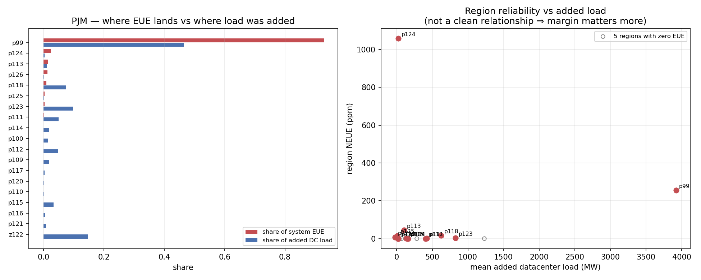
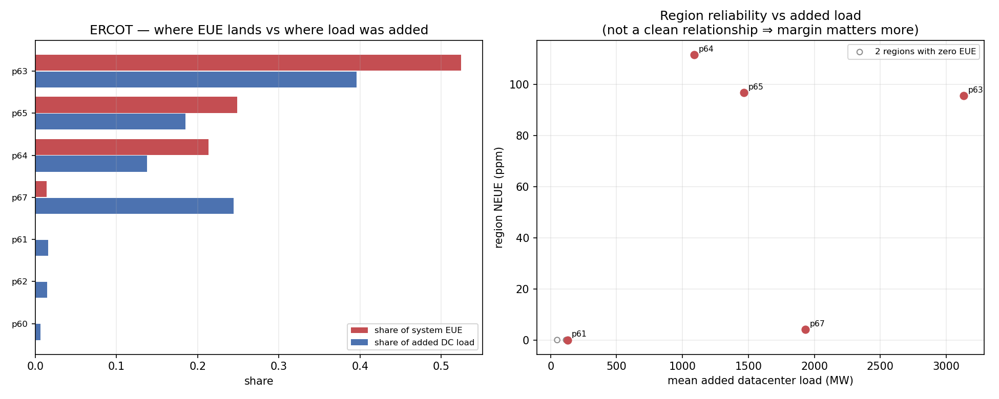
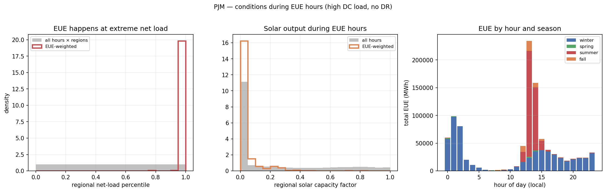
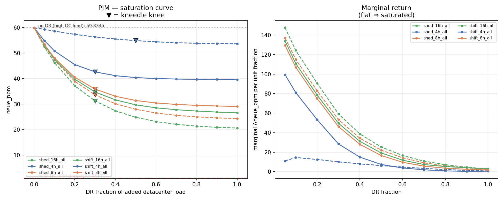
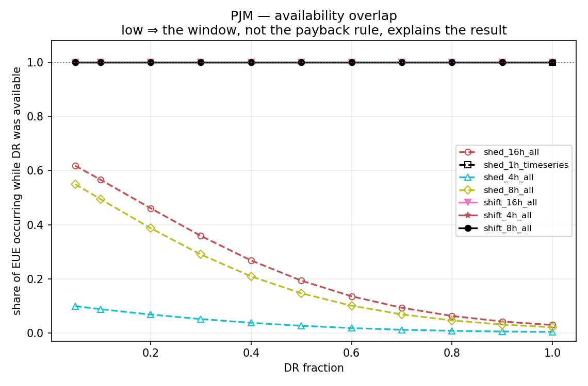

# Datacenter load, demand response, and resource adequacy — brief results

**PJM and ERCOT, ReEDS model year 2032 · PRAS · 15 weather years (2007–2021) ×
1000 Monte Carlo samples**
Input set: `neue1` (a more stressed capacity mix than the earlier runs — see note).
Prepared 2026-07-23 · reproducible via `sbatch slurm/run_all.sh`, see [README.md](README.md)

> **Note on inputs.** These results use the `neue1` PRAS systems
> (`{PJM,ERCOT}_PRAS_2032*_neue1*.pras`). They are far more capacity-constrained
> than the first-round systems: PJM's no-DR NEUE is ~330× higher than before and
> ERCOT — previously zero — now has the larger reliability problem of the two.
> An earlier version of this document described the first-round systems, in which
> ERCOT had no unserved energy and PJM's was a single-region artifact. That story
> does not carry over; this is a different, much tighter system.

---

## What was done

ReEDS built a 2032 grid under the **default** demand forecast — every generator,
battery and transmission line. That fleet was then **frozen**.

PRAS took the frozen fleet and simulated the year hour by hour, 8760 hours × 15
weather years, 1000 times over, randomly failing generators at their forced-outage
rates. Each hour it asks whether generation plus imports could serve load; when
they could not, it records the shortfall. **NEUE** (normalized expected unserved
energy, in parts per million) is that shortfall as a share of total load.

That simulation was run twice — once with normal load, once with datacenter load
added on top — **using the same power plants both times**. Then demand response
was layered on: each region received a DR device sized as a fraction of *its own
added datacenter load*, swept from 5 % to 100 %, in two flavors:

- **shift** — load moved to a later hour and repaid within the payback window; available 24/7.
- **shed** — load dropped and never repaid; available only in a fixed daily window.

Because the buildout never changes, any difference in NEUE is attributable to the
added load and to the DR — not to different generation. The question being answered
is deliberately narrow: **can flexible datacenter load substitute for generation
that was never built?**

92 PRAS runs in total: 68 PJM (shed + shift × {4,8,16} h × 11 fractions), 24 ERCOT
(shift only × {4,8} h × 11 fractions).

---

## Headline results

### 1. Both systems are heavily stressed; ERCOT is now the worse of the two

| | base (no DC) | **+ datacenter load, no DR** | best DR case |
|---|---:|---:|---:|
| **PJM** | 1.05 ppm | **59.8 ppm** (1,003,700 MWh) | 20.6 ppm — `shed_16h` @ 100 % |
| **ERCOT** | 1.00 ppm | **72.1 ppm** (804,376 MWh) | 56.2 ppm — `shift_8h` @ 100 % |

Adding datacenter load raises NEUE **61× in PJM and 79× in ERCOT**. These are large
reliability shortfalls in absolute terms, not the marginal signals of the earlier
runs. Both systems are genuinely short of capacity once the datacenter load arrives.

### 2. EUE lands where the datacenter load lands — the opposite of the earlier runs

**PJM: 93 % of the unserved energy is in region p99**, which also receives **47 %
of the added datacenter load** — the most of any region. p99 runs a *negative*
average margin (−7,798 MW; its capacity is below its load on average), so the
datacenter load lands squarely on the most capacity-short region.

**ERCOT: 98 % of the EUE is in three regions — p63, p65, p64** (52 %, 25 %, 21 %),
which together take **71 % of the added load**. The one exception is instructive:
**p67 receives the most added load (24 %) but produces only 1.4 % of the EUE**,
because it carries enough margin to absorb it (minimum margin −1,374 MW vs
−5,000 to −15,000 MW in the failing regions).

So in these systems datacenter DR is **well-targeted by construction** — it is
sized to the load, and the load is where the risk is. Whether it is *sufficient*
is a separate question (§6). This is the key reversal from the first-round runs,
where EUE was concentrated in a region with almost no datacenter load.

### 3. The failures are system-wide capacity shortfalls, not local pockets

| condition (PJM) | all hours | during EUE (EUE-weighted) |
|---|---:|---:|
| regional net-load percentile | 0.50 | **0.995** |
| regional margin percentile | 0.50 | **0.005** |
| regional margin (MW) | +4,061 | **−17,464** |
| solar capacity factor | 0.227 | 0.035 |
| wind capacity factor | 0.425 | 0.331 |
| added datacenter load (MW) | 444 | **3,743** |

EUE occurs at the extreme top of net load and the extreme bottom of margin, in
hours with **near-zero solar** (evenings and nights) and **elevated datacenter
load**. The average margin during EUE hours is **−17 GW** — the system is short by
many gigawatts, not by tens of megawatts. ERCOT is the same pattern (margin
percentile 0.006, solar CF 0.02, EUE-hour added load 2,076 MW vs 1,130 all-hours).

Unlike the earlier runs, wind is **not** the trigger — wind CF during EUE hours is
0.33 (PJM) / 0.19 (ERCOT), only moderately below normal. The driver is total load
against total capacity, with solar absent because the failures are after sunset.

### 4. Datacenter load creates as many new failure hours as it worsens

| | base EUE | high EUE | share in *newly*-failing hours |
|---|---:|---:|---:|
| PJM | 16,477 MWh | 1,003,700 MWh | **52 %** |
| ERCOT | 10,168 MWh | 804,376 MWh | **54 %** |

About half of the added unserved energy falls in hours (and regions) that had
**no** EUE in the base case. So the datacenter load is not merely deepening
existing scarcity — it is creating new scarcity in previously-adequate hours.
Consistent with this, the shape of *when* EUE occurs shifts substantially
(total-variation distance base→high of 0.33–0.46 for PJM, 0.43–0.72 for ERCOT).

### 5. The problem is chronic, not a handful of extreme hours

| case | EUE in top 10 h | in top 100 h | hours to reach 90 % | nonzero hours |
|---|---:|---:|---:|---:|
| PJM base | 56 % | 86 % | 195 | 1,884 |
| **PJM +DC, no DR** | 10 % | 44 % | **627** | 7,855 |
| ERCOT base | 86 % | 100 % | 14 | 86 |
| **ERCOT +DC, no DR** | 12 % | 66 % | **211** | 1,023 |

In the base cases the unserved energy is a few extreme hours. Adding datacenter
load **spreads it across hundreds to thousands of hours** — it takes 627 of the
worst PJM hours to reach 90 % of the total. This is a sustained seasonal capacity
deficit, which is exactly the kind of problem sustained DR can chip at.

### 6. DR helps materially in PJM, weakly in ERCOT — and is magnitude-limited everywhere

| DR family | system | NEUE floor at 100 % | share of DC penalty recovered |
|---|---|---:|---:|
| **shed 16 h** | PJM | 20.6 ppm | **67 %** |
| shed 8 h | PJM | 24.4 ppm | 60 % |
| shift 16 h | PJM | 26.6 ppm | 57 % |
| shift 8 h | PJM | 29.1 ppm | 52 % |
| shift 4 h | PJM | 39.6 ppm | 34 % |
| shed 4 h | PJM | 53.6 ppm | 11 % |
| **shift 8 h** | ERCOT | 56.2 ppm | **22 %** |
| shift 4 h | ERCOT | 61.4 ppm | 15 % |

PJM's best case buys back **two-thirds** of the datacenter penalty — DR is
genuinely effective here because it is well-targeted (§2) and the deficits, though
large, are spread over many hours it can address. ERCOT recovers only **~22 %**,
but that is partly because ERCOT's sweep only includes **shift**, only **4 h and
8 h** — no shed, no 16 h. It is under-equipped in the experiment, not necessarily
in principle.

**Every family is magnitude-limited** (`outputs/tables/dr_limit_diagnosis.csv`).
The always-on shift devices are fully dispatched — PJM's `shift_16h` moves
5.9 million MWh — yet still leave a 383,000 MWh shortfall. DR is being used to the
hilt; the system is simply short by more than the datacenter load can flex away.
There is **no knee past which more DR is wasted**; returns decline smoothly and
80 % of the achievable reduction needs a fraction of ~0.4 (PJM) to ~0.7 (ERCOT).

**Duration still beats deployment share.** Within PJM, moving from 4 h to 16 h
devices matters far more than raising the fraction — `shed_4h` recovers 11 % while
`shed_16h` recovers 67 %.

### 7. The shed-vs-shift comparison remains confounded (PJM)

As before, shed differs from shift in two ways at once — forgiven payback (an
advantage) and a restricted daily availability window (a handicap). The window
handicap is visible: `shed_4h` operates only 4–8 PM ET and only **0.4 %** of its
remaining EUE falls in that window, which is why it is the weakest family despite
shed's mechanistic advantage. A clean comparison still needs an **always-on shed
run** (drop `available_hours_et`) — a config change, not new code.

---

## What this means

1. **Datacenter load, on this tighter grid, is a first-order adequacy problem in
   both systems.** NEUE rises 60–80× and the deficit is chronic and system-wide,
   averaging many GW short during failure hours.

2. **DR is well-targeted here and materially effective in PJM (−67 % of the
   penalty), but it cannot close the gap** because the shortfall exceeds what the
   flexible datacenter load can supply — every family is magnitude-limited. DR is a
   substantial mitigation, not a substitute for the generation that was not built.

3. **ERCOT looks worse than PJM partly because its DR toolkit in this sweep is
   thinner** (shift-only, ≤8 h). Whether ERCOT is genuinely harder to help or just
   under-equipped needs a shed / 16 h run before drawing a conclusion.

4. **Duration beats quantity.** Longer-duration flexibility is the stronger lever
   than a higher deployment fraction.

---

## Caveats

- **Monte Carlo noise.** Case-level standard error is ~1 % of EUE. With these much
  larger EUE values the DR-sweep increments are now comfortably resolved (the best
  PJM and ERCOT cases are flagged statistically distinguishable from their
  runners-up), but single-increment differences should still be read as indicative.
- **Same buildout by construction.** Generation was not re-optimized for the higher
  load; these results describe datacenter load arriving *without* a supply
  response, which is the intended experiment, not a forecast.
- **ERCOT's DR sweep is incomplete** relative to PJM's (no shed, no 16 h), so
  cross-system DR comparisons are not apples-to-apples.
- **The DR device is regional, not datacenter-specific.** It is *sized* from
  datacenter load but PRAS reduces total regional load when it operates.
- **Event counts depend on a threshold** (`*_eps_sensitivity.csv`); totals are
  robust, counts are not.

---

## Files

| Output | Path |
|---|---|
| Figures (per system) | `outputs/figures/{pjm,ercot}_{where,when,conditions,worst_event,saturation,availability_overlap,case_ranking,return_per_mw}.png` |
| Regional attribution | `outputs/tables/{pjm,ercot}_where.csv` |
| Timing / shape shift | `outputs/tables/{pjm,ercot}_when.csv`, `_shape_shift.csv` |
| Event conditions | `outputs/tables/{pjm,ercot}_why.csv` |
| New vs amplified failures | `outputs/tables/{pjm,ercot}_delta.csv` |
| Concentration / episodes | `outputs/tables/{pjm,ercot}_concentration.csv`, `_events.csv`, `_eps_sensitivity.csv` |
| DR saturation | `outputs/tables/dr_saturation_{curves,summary}.csv`, `dr_limit_diagnosis.csv` |
| Case registry | `cache/registry.csv` |

Full detail, including data-quality issues found in the source files, is in
[FINDINGS.md](FINDINGS.md).
